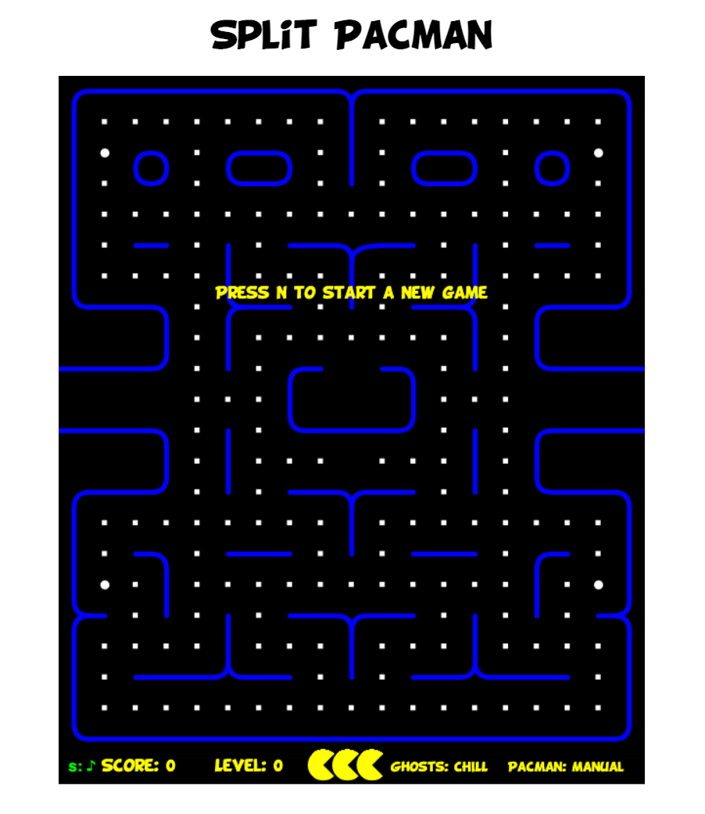

# Pure JS Pac-Man



This is based on the excellent work from [https://github.com/daleharvey/pacman](https://github.com/daleharvey/pacman)

The only major differences are breaking up the monolothic [pacman.js](https://github.com/daleharvey/pacman/blob/master/pacman.js) 
file into [modules](modules).

## Running

You need a split account to see the different play modes in action.

Go to [https://www.split.io/signup/](https://www.split.io/signup/) to create a free account.

1. Navigate to: `Split > Create Split`
2. Name the Split: `PacMan_RadarGhost`, select `user` for **traffic type**, click `Create Split`.
3. Click `Add Rules`.
4. Leave the defaults and click `Save changes`. Scroll down and click `Confirm`.
5. Click the upper left square icon (usually `DE` for default). Click `Admin settings`.
6. Click `API keys`.
7. Copy the `Client-side` key for the `Prod-Default` environment.

To learn more, go to: [https://www.split.io/product/feature-flags/](https://www.split.io/product/feature-flags/).

The requirements for running locally or in a deployed environment are minimal.

* node.js

To run locally do the following:

```
npm install
SPLIT_AUTH_KEY=<your split client auth key> npm start
```

## DEPLOYING

You can easily deploy to Heroku using the purple button:

[](https://heroku.com/deploy?template=https://github.com/splitio-examples/pac-split-man)
