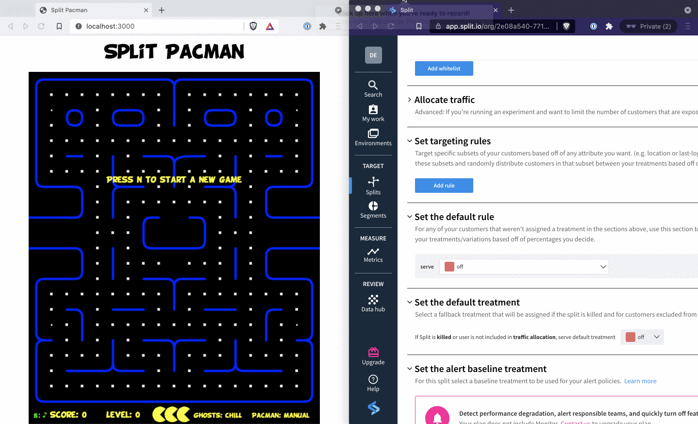
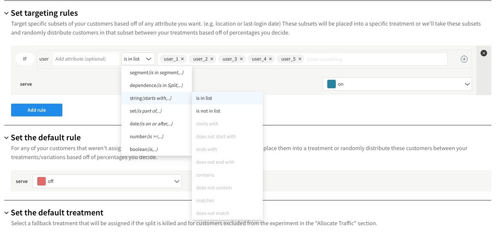

# Pure JS Pac-Man



Table of Contents:
* [Set up](#set-up)
* [Run Locally](#run-locally)
* [Deploy](#deploy)
    * [Deploy to Heroku](#deploy-to-heroku)
    * [Deploy to CodeSandbox](#deploy-to-codesandbox)
* [Basic Demonstration](#basic-demonstration)
* [Advanced Demonstration](#advanced-demonstration)
* [Data Demonstration](#data-demonstration)

Check out the blog post that uses this repo [here](https://www.split.io/blog/feature-flag-benefits-pacman/).

This is based on the excellent work from [https://github.com/daleharvey/pacman](https://github.com/daleharvey/pacman)

The only major differences are breaking up the monolothic [pacman.js](https://github.com/daleharvey/pacman/blob/master/pacman.js) 
file into [modules](modules).

## Set Up

You need a split account to see the different play modes in action.

Go to [https://www.split.io/signup/](https://www.split.io/signup/) to create a free account.

1. Navigate to: `Split > Create Split`
2. Name the Split: `PacMan_RadarGhost`, select `user` for **traffic type**, click `Create Split`.
3. Click `Add Rules`.
4. Leave the defaults and click `Save changes`. Scroll down and click `Confirm`.
5. Click the upper left square icon (usually `DE` for default). Click `Admin settings`.
6. Click `API keys`.
7. Copy the `Client-side` key for the `Prod-Default` environment.

To learn more, go to: [https://www.split.io/product/feature-flags/](https://www.split.io/product/feature-flags/).

## Run Locally

The requirements for running locally or in a deployed environment are minimal.

* [node.js](https://nodejs.org)

To run locally do the following:

```
npm install
SPLIT_AUTH_KEY=<your split client auth key> npm start
```

Continue on to the [Basic Demonstration](#basic-demonstration).

## DEPLOY

Since this is such a lightweight, vanilla JavaScript app, it is easy to run in a number of deployment environments. Below are instructions for [Heroku](https://heroku.com) and for [CodeSandbox](https://codesandbox.io).

Heroku is a good choice to deploy the app for an individual to see it in action.

CodeSandbox is a good choice to demo the app for others.

In either case, you'll need to have already [set up your Split account](#set-up).

### Deploy to Heroku

You can easily deploy to Heroku using the purple button:

[](https://heroku.com/deploy?template=https://github.com/splitio-examples/pac-split-man)

**NOTE:** You'll need your Split API key

After you click the purple button above and follow the prompts, you will have a unique heroku url, such as: [https://pac-split-man.herokuapp.com](https://pac-split-man.herokuapp.com).

Continue on to the [Basic Demonstration](#basic-demonstration).

### Deploy to CodeSandbox

You will need a free [CodeSandbox](https://codesandbox.io) account to deploy this app.

Below are instructions for importing an app from a GitHub repo. CodeSandbox will keep the app you deploy to it in sync with its source GitHub repo. As such, you may want to fork this project so that you can make changes to it.

After creating an account, follow these instructions:

1. Click **Create Sandbox** in the upper right.
2. Click **Import Project** on the left of the dialog.
3. Paste the URL to the GitHub repo and click **Import and Fork**.
    * **Note:** You should see an embedded browser on the right hand side with the pac-man game loaded. There's a icon () on the upper right to open in a new window. Doing this will give you more screen real estate to interact with the game while still keeping it in sync with CodeSandbox.
4. Click the Server Control Panel icon () on the far left.
5. In the _Secret Keys_ section section, enter: `SPLIT_AUTH_KEY` for _Name_ and paste your Split API Key for _Value_.
6. Click **Add Secret**.
7. Click **Restart Server** in the `Control Container` section on the left.
8. Click the refresh button in the browser where pac-man is running.
    
    **NOTE**: This is the only time you need to refresh the browser. From this point on, changes in the Split configuration will be reflected in the browser in near-realtime.

Continue on to the [Basic Demonstration](#basic-demonstration).

## Basic Demonstration

When you first load the pac-man game, notice that it's in `CHILL` mode ().

**NOTE**: You can click **s** on your keyboard at any time to toggle the sound.

Start playing, and notice that the ghosts are moving completely randomly. While the game is still active, click **p** on your keyboard to pause the game.

Back in your Split admin console, click **Splits** and click **PacMan_RadarGhost**. Scroll down on the right and change the value for `serve` in the `Set the default rule` section to **on**. Click **Save changes** and click **Confirm**.

Notice that the mode has changed to `RADAR` mode ().

Click **p** on your keyboard to un-pause the game. And now, you better run! The ghosts are now very aware of your position and they are all heading for it.

Feel free to switch back to `CHILL` mode by setting the default rule to **off**. You should notice that the ghost mode in the game switched in near-realtime as you make changes in Split.

### Basic Demonstration Summary

Key takeaways from this demonstration are:

* Configuring your app to communicate with Split requires an API Key.
* Treatment state can be managed easily from your Split Admin Console.
* Changes to treatments in Split are reflected in your apps in near-realtime thanks to Split's streaming capabilities.

## Advanced Demonstration

In the [Basic Demonstration](#basic-demonstration), you experienced some of the power of live state change with Split. So far, it's been a global setting: either everyone always gets the `CHILL` ghost mode or everyone always gets the `RADAR` ghost mode.

Split has a lot more power through fine grained control on how and when users see different treatments.

A `segment` is a grouping of users along some common dimension. Let's set up pac-man to `RADAR` mode for select users.

From your Split admin console click **Segments**. Click **Create segment**. Name it: `PacMan_RadarGhost_Users` and click **Create**. Click **Add definition**. Click **Add user > Add individually**. Where it says `Start typing a user`, enter: **bob** and click **add new User: bob**. Repeat the same for a user named **sally**. Click **Confirm**.

Click **Splits** and click **PacMan_RadarGhost**.

**NOTE**: At this point, set the default rule to serve **off** if it isn't already. 

In the `Set targeting rules` section, click **Add rule**. This will open up a dialog with some defaults set. You can read this as a sentence: `If user is in segment...`. Click **Select Segment...** and click **PacMan_RadarGhost_Users**. Change the `serve` value from **off** to **on**. Click **Save changes** and then click **Confirm**.

Back in the browser with the pac-man app, add the following to the end of the url: `?key=jim` and hit enter.

For instance, if you deployed to codesandbox.io, your url would look something like this: `https://byrl4.sse.codesandbox.io?key=jim`. If you are running the app locally, your url would look something like this: `http://localhost:3000?key=jim`.

Notice that the ghosts mode is `CHILL`. Repeat the above, but change the end of the url to: `?key=bob`. Notice that now the ghosts mode is `RADAR`!

Unlike before, when the mode was globally set to **on** or **off**, it's now different depending on the user identified by `key`. If you change the end of the url to `?key=sally`, the mode should still be `RADAR`. For any value - other than `sally` or `bob`, the mode should be `CHILL`.

Let's refine the rule even further. To the right of the rule you just added, click the plus sign (). In the field showing `Add attribute` to the right of `user` enter: **special_beta_tester**. In the dropdown to the right of this field, select **boolean > is**. In the dropdown to the right of **is** select **true**. This rule should now look like this:


Click **Save changes** and click **Confirm**.

Now, back in the browser where pac-man is running, change the end of the url to: `?key=bob`. Notice that the mode is `CHILL`. Even though `bob` is in the `PacMan_RadarGhost_Users` segment, the attribute: `special_beta_tester` has not been satisfied. Now, change the end of the url to: `?key=bob&special_beta_tester=true`. Now the mode is `RADAR`.

The last thing to examine here is the "Kill Switch". Imagine you have a complex set of rules that determine who sees a new feature and who doesn't. Now imagine that something's gone horrible wrong with this new feature. In the old days, you'd have to deploy a patch or deploy a rollback as fast as you can. Now, you can use an easy feature of Split to quickly turn off the feature for everyone.

Make sure you're currently seeing the `RADAR` mode in the browser with the pac-man app.

Back over in Split, click **Splits** and click **PacMan_RadarGhost**. Click **Kill**. Enter **KILL** in the field and click **Kill**.

**NOTE**: This may seem redundant, but since this will impact all users, Split takes great care to make sure you really want to kill a feature.

Back in the pac-man browser tab, you should notice that the mode is now `CHILL`, even if the end of the url is `key=bob&special_beta_tester=true`.

You can easily restore the feature flag back to it's former settings by clicking **Restore** in Split.

### Advanced Demonstration Summary

* Split makes it easy to have fine-grained control over the values that are returned from a treatment
* One dimension of granularity is a `segment` that identifies groups of like things - like users.
* Another dimension of granularity is arbitrary attributes that can be passed over to split and evaluated.
* If a feature behind a feature flag gets out of control, it's easy to kill it for everyone using Split's kill switch.

## Data Demonstration

Among the things that differentiate Split from its competitors is the ability to generate and track events, 
automatically detect and notify deviations from expected behavior, and to run sophisticated experiments.

Data gathering only becomes useful when there's a large volume of data across many users. The Pac-Man game has a mode
to generate a volume of events that mimics many games played over time.

To set the stage for this part of the demonstration, return to your Split admin console.

Click **Splits** and click **PacMan_RadarGhost**.

Click **Add rule** in the `Set targeting rules` section.

From the dropdown, choose **string(starts with,...) > is in list** and then in the textbox, enter
**user_1**, **user_2**, **user_3**, **user_4**, **user_5**.

**NOTE**: After each user entry (eg **user_1**), hit **enter** so that split recognizes the value.

It should look similar to this:



It's a compelling demonstration of what we're setting up here to have a split-screen set up with the pac-man game on the left and the Split admin console on the right.

In the Split admin console, click **Data hub** on the lower left. From the `Data type` dropdown, select **Events**. Click **Query** to start a live tail of events.

In the pac-man window, open the developer tools, focus on the console and navigate to: `http://localhost:3000/?fireEvents=true`

You'll see output in the browser console showing that events are firing.

In the Split admin console window, you should see events to start rolling in.

**NOTE**: It may take some time for events to start showing in the Split admin console.

Now that you've seen this in action, let's break down what's going on here.

For this part of the demonstration, we're simulating lots of pac-man sessions over time. Some will have the ghosts in the radar mode and some will have the ghosts in the chill mode.

When the ghosts are in radar mode, pac-man dies sooner - somewhere within 3 and 10 seconds.

when the ghosts are in chill mode, pac-man survives longer - somewhere within 30 and 100 seconds.

The way we're simulating this activity is to setup 10 Split clients. Half are configured such that when `getTreatment('PacMan_RadarGhost')` is called, `on` is returned. For the other half, `off` is returned.

A call to `client.track('user', 'PacMan_TTL', ttl)` is made every quarter-second for 40 seconds for a total of 160 tracking calls (simulating 160 pac-man deaths at the hands of the ghosts).

This is the critical piece of code being run:

```
function fireEvents() {
    var origKey = SplitConfig.core.key;
    var clients = [];
    for (let i=0;i<10;i++) {
        SplitConfig.core.key = `user_${(i+1)}`
        clients.push({ 
            user: SplitConfig.core.key, client: splitio(SplitConfig).client() 
        });
    }
    const interval = setInterval(() => {
        var clientInfo = clients[randomIntFromInterval(0, 9)];
        clientInfo.client.ready().then(() => {
            var treatmentResult = clientInfo.client.getTreatment(
                'PacMan_RadarGhost', attributes
            );
            var ttl = (treatmentResult === 'on') ? 
                randomIntFromInterval(3000, 10000) :
                randomIntFromInterval(30000, 100000);
            console.log(`ttl for user: ${clientInfo.user} is ${ttl} ` + 
                `with treatment: ${treatmentResult}`);
            localClient.track('user', 'PacMan_TTL', ttl);
        });
    }, 250);

    setTimeout(() => {
        clearInterval(interval);
        SplitConfig.core.key = origKey;
    }, 40000);
}
```

The `for` loop at the top constructs 10 instances of the Split client. Based on the targeting rules set up earlier, half of these clients will get the `on` treatment and half will get the `off` treatment.

Next, a call to `setInterval` is made with an interval of 250 milliseconds.

For each interval, one of the 10 clients is selected at random. A call to `getTreatment` is made. A random time-to-live value is set based on returned value of the call to `getTreatment`.

A call is made to the `track` function passing in `PacMan_TTL` as the event name to track.

Outside the `setInterval` function a call to `setTimeout` is made with a value of 40 seconds. The code that is executed after the 40 seconds clears the interval, thus stopping the calls to `track`.

### Data Demonstration Summary

* Split makes it easy to define and track events along whatever dimensions make sense for use case
* With lots of captured data, you can set up an experiment to get hard data on how effective your new features are performing
* For the purposes of demonstration, we mocked out a bunch of events.
* In a real production scenario, these events would naturally be fired and a large volume of data would be collected by end-users using the application.